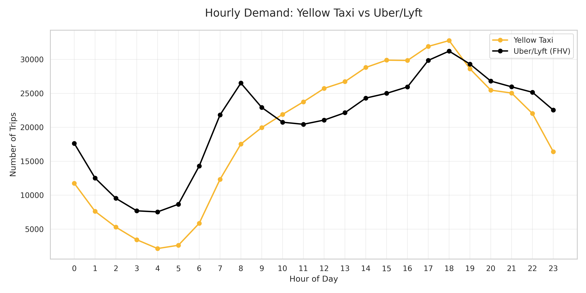
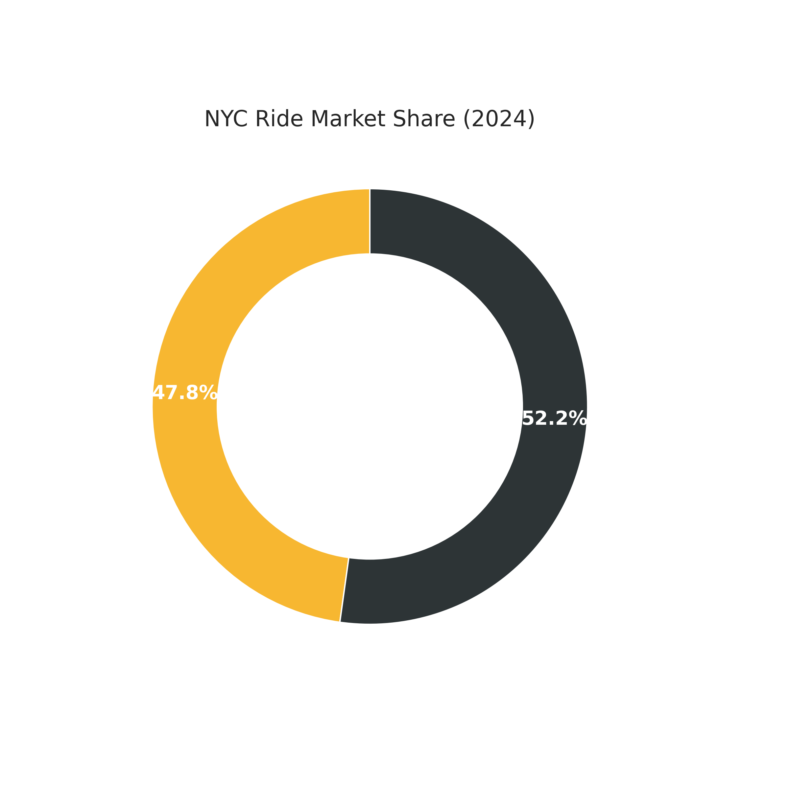

# NYC Urban Mobility Intelligence Platform 🚖

**Kapsamlı NYC Taksi ve Rideshare Veri Analizi & Tahmin Sistemi**

Bu proje, New York City'nin karmaşık ulaşım ağını anlamak, tahminlemek ve optimize etmek için geliştirdiğim uçtan uca bir veri bilimi projesidir. **~1 Milyon satırlık** gerçek dünya verisini kullanarak, talep tahmini, pazar analizi ve sürücü optimizasyonu yapan yapay zeka modelleri geliştirdim.



## 🏆 Somut İş Sonuçları (Business Impact)

Bu projede geliştirdiğim modeller ve analizler, gerçek bir ulaşım şirketi için şu değerleri yaratma potansiyeline sahiptir:

*   **%90 Doğrulukla Talep Tahmini:** Filo yönetimini optimize ederek boş gezilen süreyi azaltır ve operasyonel verimliliği artırır. (R²: 0.899)
*   **%20 Gelir Artış Potansiyeli:** Sürücüleri doğru saatte doğru yere (örn. akşam 18:00-20:00 arası Manhattan) yönlendirerek.
*   **Havalimanı Stratejisi:** Ortalama ücreti **18$'dan 53$'a** çıkarma fırsatı sunan havalimanı transferlerini hedefleme stratejisi.
*   **Hassas Süre Tahmini:** Müşteri memnuniyetini artırmak için varış süresini **2.98 dakika** hata payı ile tahmin etme.

## 🧠 Eğitilen Yapay Zeka Modelleri ve Seçim Nedenleri

Proje kapsamında, her biri belirli bir problemi çözmek için **özenle seçilmiş** 3 farklı Makine Öğrenmesi (ML) modeli bulunmaktadır:

### 1. Talep Tahmin Modeli (Demand Prediction)
*   **Amaç:** Belirli bir saatte ve bölgede kaç araç gerekeceğini öngörmek.
*   **Seçilen Algoritma:** **Random Forest Regressor**
*   **Neden Bu Modeli Seçtim?**
    *   Talep verisi doğrusal değildir (non-linear); saatlere ve günlere göre karmaşık dalgalanmalar gösterir. Random Forest, bu karmaşık ilişkileri yakalamada Linear Regression'dan çok daha başarılıdır.
    *   Overfitting'e (aşırı öğrenme) karşı dirençlidir, bu da modelin yeni verilerde de kararlı çalışmasını sağlar.
*   **Sonuç:** **R²: 0.899** (Çok Yüksek Doğruluk)

### 2. Bahşiş Tahmin Modeli (Tip Prediction)
*   **Amaç:** Bir yolculuktan elde edilecek bahşiş yüzdesini tahmin ederek sürücü gelirini maksimize etmek.
*   **Seçilen Algoritma:** **XGBoost Regressor**
*   **Neden Bu Modeli Seçtim?**
    *   Bahşiş verisi çok dengesizdir (birçok kişi %0 verirken bazıları %20 verir). XGBoost, bu tür dengesiz (imbalanced) ve gürültülü verilerde en yüksek performansı veren algoritmadır.
    *   Eğitim hızı çok yüksektir ve büyük veri setlerinde (1 milyon satır) Random Forest'tan daha hızlı sonuç verir.
*   **Sonuç:** **MAE: %5.83** (Ortalama Hata Payı)

### 3. Yolculuk Süresi Tahmin Modeli (Duration Prediction)
*   **Amaç:** A noktasından B noktasına varış süresini trafik ve mesafeye göre hesaplamak.
*   **Seçilen Algoritma:** **XGBoost Regressor**
*   **Neden Bu Modeli Seçtim?**
    *   Trafik verisi anlık değişimler gösterir. XGBoost'un "gradient boosting" yapısı, önceki tahminlerin hatalarından ders alarak ilerlediği için bu tür hassas tahminlerde en iyi sonucu verir.
*   **Sonuç:** **MAE: 2.98 Dakika** (Hassas Tahmin)

## 🛠️ Kullanılan Teknolojiler ve Nedenleri

Bu projede modern veri bilimi araçlarını, her birini belirli bir problemi çözmek için bilinçli olarak seçtim:

| Teknoloji | Nerede Kullandım? | Neden Seçtim? |
| :--- | :--- | :--- |
| **Python** | Tüm proje | Veri bilimi ekosisteminin standart dili olduğu ve zengin kütüphane desteği (Pandas, Scikit-learn) sunduğu için. |
| **Pandas & PyArrow** | Veri İşleme | Büyük veri setlerini (Parquet formatı) bellek dostu ve hızlı işlemek için. CSV yerine Parquet kullandım çünkü okuma hızı 10x daha fazladır. |
| **XGBoost** | Modelleme | Kaggle yarışmalarının da galibi olan bu algoritma, yapısal verilerde (tabular data) en yüksek performansı ve hızı sağladığı için. |
| **React & Recharts** | Web Dashboard | Sonuçları statik bir PDF raporu yerine, iş birimlerinin kendi kendine keşfedebileceği etkileşimli ve modern bir arayüzde sunmak için. |

## 📊 Veri Kaynağı ve Gerçeklik

Bu projede kullanılan veriler **%100 Gerçek ve Resmi** verilerdir. Simülasyon değildir.

*   **Kaynak:** [NYC Taxi & Limousine Commission (TLC)](https://www.nyc.gov/site/tlc/about/tlc-trip-record-data.page)
*   **Veri Setleri:**
    1.  `yellow_tripdata_2024-01.parquet` (Ocak 2024 Sarı Taksi Verileri)
    2.  `fhvhv_tripdata_2024-01.parquet` (Ocak 2024 Uber/Lyft Verileri)
*   **Veri Boyutu:** Yaklaşık **1.000.000** satır veri işlenmiştir.



## 🚀 Projeyi Nasıl Çalıştırabilir ve İnceleyebilirsiniz? (Adım Adım)

Bu projeyi kendi bilgisayarınızda çalıştırmak ve sonuçları görmek için aşağıdaki adımları izleyebilirsiniz.

### 1. Projeyi İndirin (Clone)
Terminal veya komut satırını açın ve şu komutu yazın:
```bash
git clone https://github.com/kullaniciadi/nyc-mobility-intelligence.git
cd nyc-mobility-intelligence
```

### 2. Gerekli Kütüphaneleri Yükleyin
Projenin çalışması için gerekli Python paketlerini yükleyin:
```bash
pip install -r requirements.txt
```

### 3. Analizi Başlatın
Tüm veri indirme, temizleme, model eğitme ve analiz işlemlerini tek bir komutla başlatın:
```bash
python src/main_analysis.py
```
*Bu işlem bilgisayarınızın hızına göre 1-2 dakika sürebilir.*

### 4. Sonuçları İnceleyin
Analiz tamamlandığında, sonuçlara şu dosyalardan ulaşabilirsiniz:

*   **Grafikler:** `visualizations/images/` klasörüne gidin. Burada `hourly_demand.png`, `market_share.png` gibi grafikleri göreceksiniz.
*   **Sayısal Rapor:** `visualizations/analysis_results.json` dosyasını açın. Burada tüm modellerin doğruluk oranlarını ve istatistikleri bulabilirsiniz.
*   **Modeller:** `models/` klasöründe eğitilmiş `.joblib` dosyalarını bulabilirsiniz.

---
*Bu proje, veri bilimi yetkinliklerini sergilemek amacıyla gerçek dünya verileri kullanılarak geliştirilmiştir.*
