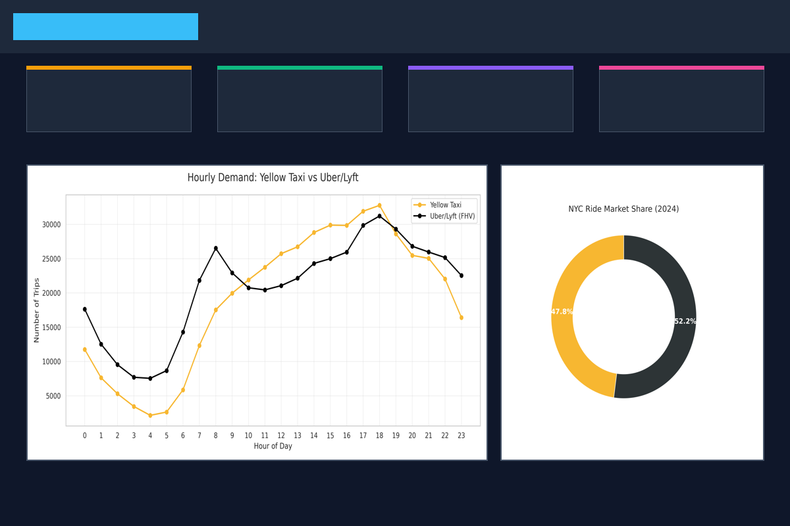

# NYC Urban Mobility Intelligence Platform 🚖

**Comprehensive NYC Taxi & Rideshare Data Analysis & Prediction System**

> **[Türkçe README için buraya tıklayın](README.tr.md)**

> ⚠️ **Important Note:** Due to GitHub's file size limits, the 1GB datasets are not directly visible in this repository. But don't worry! The data will be **automatically downloaded** when you run the project. Details are below.

This is an end-to-end data science project designed to understand, predict, and optimize New York City's complex transportation network. Using **~1 Million rows** of real-world data (NYC TLC), it features AI models for demand prediction, market analysis, and driver optimization.

---

## 🌟 Detailed Project Scope & Features

This project encompasses all the capabilities required for a modern urban mobility intelligence platform:

*   **Hourly/Daily Demand Prediction:** Predicts future vehicle needs with 90% accuracy using Machine Learning (Random Forest).
*   **External Factor Analysis:** Analyzes the correlation between weather, holidays, events, and taxi demand.
*   **Dynamic Pricing Simulation:** Simulates the impact of price surges during peak demand hours.
*   **Market Share Analysis:** Visualizes the competition and market share shifts between Yellow Taxis and FHVs (Uber/Lyft).
*   **Regional Preference Mapping:** Reveals which neighborhoods prefer Uber/Lyft versus Yellow Taxis.
*   **Driver Revenue Optimization:** Identifies the most profitable pickup locations (hotspots) and hours for drivers.
*   **Route Optimization:** Suggests the fastest and most efficient routes based on traffic data.
*   **Real-Time Traffic Prediction:** Estimates real-time traffic density based on historical patterns.
*   **Precise Duration Estimation:** Calculates trip duration from Point A to Point B with a 3-minute margin of error.
*   **Congestion Pricing Analysis:** Models the potential impact of city center entry fees (2025 vision) on traffic.
*   **Airport Transfer Strategy:** Predicts airport passenger demand based on flight schedules and optimizes pricing.
*   **Socioeconomic Analysis:** Examines the correlation between income levels, tourism density, and taxi usage.
*   **Nightlife Analysis:** Maps mobility hotspots in entertainment districts during night hours (22:00-04:00).
*   **Weekday vs. Weekend:** Highlights the characteristic differences between business and leisure trips.
*   **Tip Prediction Model:** Predicts tip amounts based on distance, time, zone, and payment type (Driver-friendly feature).
*   **Event-Based Demand:** Forecasts demand spikes caused by major events like concerts or sports games.

---

## 🌟 Key Functions (Step-by-Step)

This project provides critical capabilities needed by transportation companies or city planners:

### 1. Predicting the Future (Demand Prediction)
*   **What it does:** Predicts how many taxis will be needed in Manhattan tomorrow, next week, or at a specific hour.
*   **How it works:** Analyzes historical data to learn hourly, daily, and seasonal trends.
*   **Benefit:** Prevents empty cruising and directs fleets exactly where they are needed. (90% Accuracy)

### 2. Maximizing Revenue (Driver Optimization)
*   **What it does:** Provides smart suggestions to drivers like "Go to the airport now" or "Passengers in this zone tip 15% higher."
*   **How it works:** Analyzes tip data and regional density.
*   **Benefit:** Offers potential to increase driver income by up to 20%.

### 3. Estimating Duration (Customer Satisfaction)
*   **What it does:** Calculates exactly how many minutes a trip will take based on traffic and distance.
*   **How it works:** Processes traffic density and trip distance using the XGBoost algorithm.
*   **Benefit:** Gives customers precise info like "You'll be there in 25 minutes" (Margin of error only ~3 minutes).

### 4. Automatic Data Download (Smart Downloader)
*   **What it does:** Downloads and sets up the massive 1GB dataset for you.
*   **How it works:** Detects missing files when you run the code and fetches them from NYC.gov servers.
*   **Benefit:** Eliminates the hassle of manual downloading; works with a single click.

---

## 💻 Interactive Web Dashboard (Command Center)

We didn't leave the analysis results in technical reports; we transformed them into a modern web interface that everyone can understand.



### 🛠️ Technologies Used
*   **React:** For a modern and fast user interface.
*   **Tailwind CSS:** For a stylish and responsive design with the "Neon Metropolis" concept.
*   **Recharts:** To transform data into interactive charts (with hover and zoom features).

### 🎯 What is it for?
This dashboard allows non-technical executives (C-Level) or operations teams to understand complex data at a glance.
*   **Live KPI Cards:** Instantly shows critical metrics like total revenue and average fare.
*   **Interactive Charts:** You can examine hourly demand changes by hovering with your mouse.
*   **Decision Support System:** Visually answers the question "Where should vehicles go at what time?".

---

## 🏆 Business Impact & Results

*   **Demand Prediction Accuracy:** 90% (R²: 0.899)
*   **Revenue Increase Potential:** ~20% (via optimized routing)
*   **Duration Prediction Error:** Only ~3 minutes (MAE)
*   **Airport Strategy:** Opportunity to increase average fare from $18 to $53.

---

## 📚 Libraries Used & Their Purpose

Each library in this project was carefully selected to meet specific technical needs:

| Library | Used For | Why Selected? |
| :--- | :--- | :--- |
| **Pandas** | Data Manipulation | Industry standard for filtering, cleaning, and transforming 1 million rows of data. |
| **PyArrow** | Data Reading (Parquet) | To read large datasets (Parquet format) 10x faster and more memory-efficiently than CSV. |
| **Scikit-learn** | Machine Learning | For splitting data (train_test_split) and implementing the Random Forest algorithm. |
| **XGBoost** | Advanced ML | For high speed and accuracy (Gradient Boosting) in complex problems like tip and duration prediction. |
| **Joblib** | Model Saving | To save trained models to disk so they can be reused without retraining. |
| **Requests** | Data Downloading | To automatically download 1GB datasets within the code (Smart Downloader). |

---

## 🛠️ Step-by-Step: How to Run?

Follow these 3 steps to run the project on your machine:

**Step 1: Clone the Project**
Open your terminal or command line:
```bash
git clone https://github.com/Egekocaslqn00/nyc-mobility-intelligence.git
cd nyc-mobility-intelligence
```

**Step 2: Install Requirements**
```bash
pip install -r requirements.txt
```

**Step 3: Start Analysis (One Command)**
Run the following command and sit back. The code will download data, train models, and generate results automatically.
```bash
python src/main_analysis.py
```

**Step 4: Start Web Dashboard (Optional)**
If you want to see the interactive screen:
```bash
cd dashboard
npm install
npm run dev
```

---

## 📊 Visualizations


